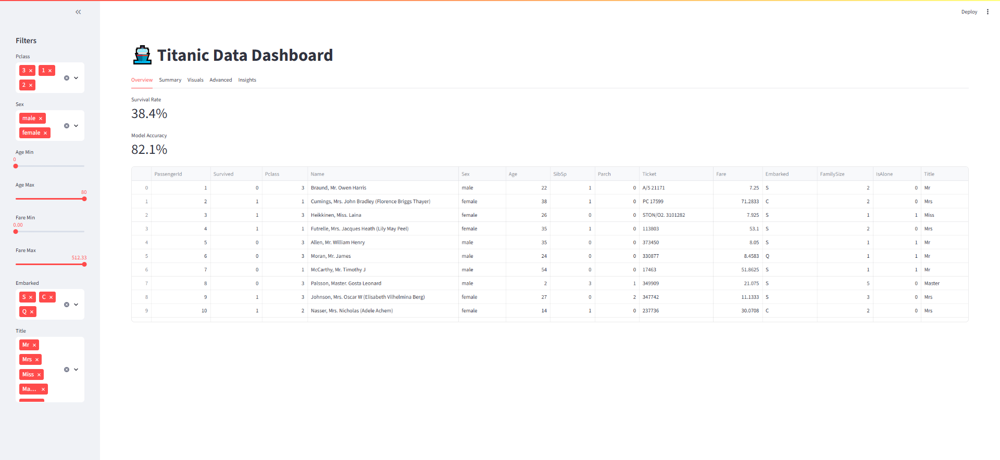
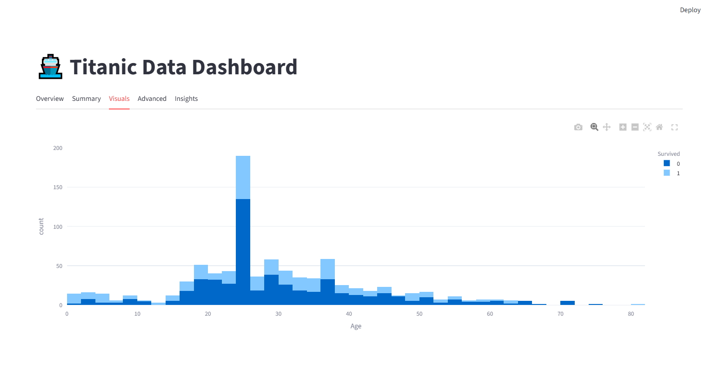

# Titanic Survival Insights App

An **interactive, data-driven dashboard** built with **Streamlit** for exploring survival patterns in the classic **Titanic dataset**. This project demonstrates a complete data analytics workflow — from data cleaning and feature engineering to visualization, statistical analysis, and interactive filters — all packaged into an interactive web app.

---

## 📊 Overview

This dashboard allows users to explore how different passenger attributes (e.g., age, gender, class, family size, embarkation port) affected survival rates in the Titanic tragedy.

Key features include:

- Dynamic filters for exploring subsets of data
- Multiple visualization types (histograms, bar charts, correlation matrices)
- Feature engineering (e.g., Family Size, Title extraction)
- Statistical tests (Chi-Square, T-Test)
- Optional basic logistic regression prediction of survival probability

---

## 🧩 Project Structure


---

## 📌 Demo Screenshot

*(Replace with your own screenshot paths)*





---

## 🚀 Features

### 🔍 Interactive Filters

Selectively explore:

- Passenger class
- Sex
- Age range
- Fare range
- Embarkation port
- Title (Mr, Mrs, Miss, etc.)

### 📈 Visualizations

- **Survival by Sex**
- **Age distribution**
- **Survival by Family Size**
- **Interactive scatter plots**
- **Correlation heatmap**

### 📋 Statistical Insights

Automated statistical tests:

- **Chi-Square Test** for categorical dependencies
- **T-Test** comparing groups (e.g., age by survival)

### 💡 Predictive Insight

Estimate survival probability for a hypothetical passenger using logistic regression.

---

## 🛠 Usage

### 📥 Setup

1. Clone the repository:

```bash
git clone https://github.com/HussnainZahid/titanic-survival-insights-app.git
cd titanic-survival-insights-app
